# Lottery game :moneybag:

## Table of Contents

- [Italian Lottery Game](#italian-lottery-game)<br>
- [Install and Run the Project](#install-and-run-the-project)<br>
- [How To Play](#how-to-play)<br>
  - [Add A Ticket](#1-add-a-ticket)<br>
  - [Print Tickets](#2-print-tickets)<br>
  - [Extract Numbers](#3-extract-numbers)<br>
  - [Print The Extraction](#4-print-the-extraction)<br>
  - [Check For Winning Tickets And Print Them](#5-check-for-winning-tickets-and-print-them)<br>
  - [Exit game](#0-exit-game)<br>
- [Technical Documentation](#technical-documentation)

## Italian Lottery Game

This project simulates the Italian lottery game.

The lottery game (or "Lotto") is based on an extraction of numbers with cash prizes in case of winning.

In particular, the Lotto game involves the extraction of 5 numbers (between 1 and 90) for each of 10 italian cities:

- Bari
- Cagliari
- Firenze
- Genova
- Milano
- Napoli
- Palermo
- Roma
- Torino
- Venezia

It is possible to bet until 10 numbers and choose different types of play:

- _Ambata_: guess one extracted number
- _Ambo_: guess two extracted numbers
- _Terno_: guess three extracted numbers
- _Quaterna_: guess four extracted numbers
- _Cinquina_: guess five extracted numbers

More about the Italian lottery game (written in Italian):

- https://www.sisal.it/lotto/come-si-gioca
- https://www.servizitelevideo.rai.it/televideo/pub/pagina.jsp?p=786&s=0&r=Nazionale&idmenumain=0

## Install and Run the Project

First of all, you need to have Node.js installed.
To check if it is already installed, run this command in your terminal:

```sh
node -v
```

If you have it installed, you will see the version, for example _v18.14.2_. If not, download it here: [Download](https://nodejs.org/en/download/current).

After that, download the folder of this project by clicking on the green button "Code" and then select "Download ZIP", extract it then open it with your favorite IDE.
Alternatively, clone the repository with the command:

```sh
git clone https://github.com/EvaLa94/lotto-game.git
```

Once you have opened the folder in your IDE, in order to install the dependencies, run the following command in your terminal:

```sh
npm install
```

In order to start a new game, run the following command in your terminal:

```sh
npm start
```

## How To Play

When you launch the game, you will find all the options that the game offers.

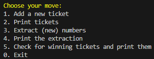

### 1. Add A Ticket

In order to add a (new) ticket, type _1_ in the console to select the option _"Add a new ticket"_.

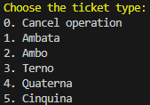

First of all, you are presented with the option to choose the **ticket's type**. You can select the type by typing in the console the corresponding number (from _1_ to _5_). If you wish to cancel the ticket creation, type _0_ in order to cancel the operation and come back to the menu options. It will be possible to cancel the operation in every step of the ticket creation, by entering _0_ in the console.

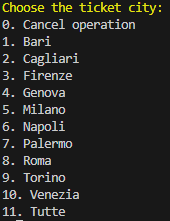

After choosing the ticket type, you should choose the **city** to bet on. You can choose on the cities in the list, or you can choose _"Tutte"_ to select them all.

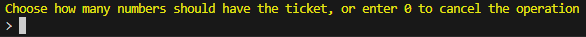

The next step is to choose how many **numbers** to generate: the numbers will be automatically generated by the application.
There are a few limitations in this step:

- The maximum numbers' quantity is set to 10. If you enter a number greater than 10, you will receive an error message and it will be possiblet to try again.
- The minimum numbers' quantity depends on the ticket's type chosen:
  - Ambata: at lest 1
  - Ambo: at lest 2
  - Terno: at lest 3
  - Quaterna: at lest 4
  - Cinquina: at lest 5

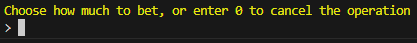

The last step is to choose how much to **bet** on the ticket. The only limitation here is that a number greater than zero should be entered.

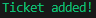

After completing the procedure, you will receive a message confirming that the ticked as been added.

### 2. Print Tickets

In order to print the tickets that have been previously added to the game, select _2_ in the menu options.

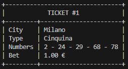

All the tickets that have been previously created will be printed in the console in a nice format.

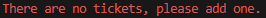

Please be aware that if you select this option before creating any ticket, you will receive an error message, since there aren't any tickets to be printed.

### 3. Extract Numbers

In order to create a new extraction, select _3_ in the menu options.

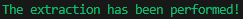

If the extraction was successfull, a confirmation message will be printed in the console.

It will be possible to perform an extraction:

- Before checking for winning tickets
- Even after checking for winning tickets, but only if none of the tickets were winning.

If you try to perform a new extraction after one of the tickets was winning, you will get a message error:

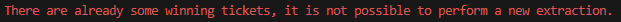

### 4. Print The Extraction

In order to print the extraction, select _4_ in the menu options.

If an extraction has already been performed, the extracted numbers for each city will be printed in the console:

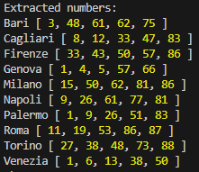

If you try this option before performing an extraction, you will receive an error message:

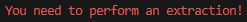

### 5. Check For Winning Tickets And Print Them

After adding at least one ticket and performing an extraction, it will be possible to check if the ticket(s) is/are winning.

The winning tickets will be printed in the console, with their corresponding gross and net winning amount:

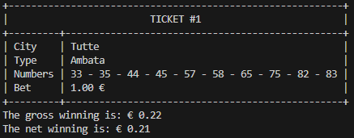

If none of the tickets are winning, a message will inform you:

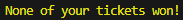

Error messages will be printed instead if:

- The extraction hasn't been performed yet:

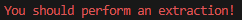

- A ticket hasn't been added yet:

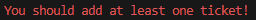

### 0. Exit Game

At any point of the game, select _0_ in the menu options if you wish to quit the game.

A message will be printed to confirm that the game has ended:

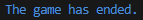

Be aware that after exiting the game, any performed action will be reset.

## Technical documentation

To access the technical documentation, run in the terminal the following command:

```sh
npm run build-docs
```

A new folder called _docs_ will be created. Open the file _index.html_ in the browser in order to access to the complete technical documentation.
